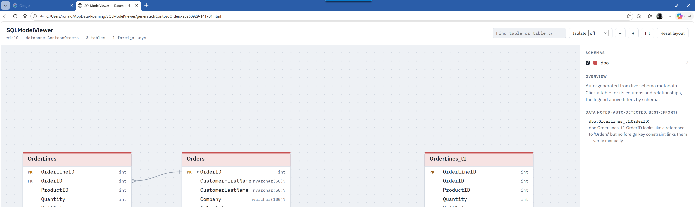

# SQLModelViewer

An interactive, auto-generated entity-relationship diagram viewer for SQL Server databases —
built to replace SSMS's database diagram tool, which is slow, doesn't scale past a handful of
tables, and has no search, filtering, or relationship highlighting.

Connect, pick the tables you care about, and it generates a single self-contained HTML file you
can open in any browser or send to a colleague — no viewer app required to *look* at the result,
even though generating it does need this tool.


The generated HTML is a genuinely standalone artifact — open it in any browser, no server or app
running:



## Features

- **Auto schema discovery** — tables, columns, primary/foreign keys, and `MS_Description`
  documentation read directly from SQL Server's catalog views. No manual curation.
- **Auto layout** — a layered graph algorithm places tables by FK dependency depth and clusters
  them by schema, handling cycles, self-references, and disconnected components automatically.
- **Pan, zoom, drag** — drag tables to reposition them (saved per-database in your browser), scroll
  to zoom, drag the background to pan, "Fit" and "Reset layout" buttons.
- **Search** — find a table, or a specific `table.column`, instantly.
- **Click to highlight** — click a table to highlight its direct relationships and dim everything
  else.
- **Isolate mode** — show only a table and its N-hop neighbors, so you're never staring at
  whole-database spaghetti just to understand one corner of the schema.
- **Schema legend** — filter the diagram by schema, color-coded automatically.
- **Column detail** — data type, nullability, identity, and description shown per column.
- **Row counts** — optional, shown per table when enabled (requires `VIEW DATABASE STATE`).
- **Auto-detected data notes** — self-referencing FKs and FK-shaped columns with no matching
  constraint are flagged automatically (best-effort heuristic, not ground truth).
- **Light/dark theme**, keyboard navigation, responsive layout — in both the desktop app and every
  generated diagram.

## Download

Download the latest self-contained win-x64 build from the
[Releases page](https://github.com/ronaldgithub/SQLModelViewer/releases) (no .NET runtime install
required). Unzip and run `SQLModelViewer.App.exe` for the desktop app, or `SQLModelViewer.Cli.exe`
for the headless command-line generator.

The desktop app's embedded live preview uses the Microsoft Edge WebView2 Runtime, which ships with
Windows 11 and most up-to-date Windows 10 installs. If it's missing, the app still works fully
(connect, generate, save, open in your browser) — you just won't get the in-app preview until you
install the [WebView2 Runtime](https://developer.microsoft.com/microsoft-edge/webview2/).

## Quick start (desktop app)

1. Enter a server name, pick Windows or SQL authentication, and click **Connect**.
2. Pick a database from the dropdown — its tables load automatically.
3. Check the tables you want (or **All**), optionally enable **Row counts**, and click **Generate**.
4. Explore the diagram in the embedded preview, then **Save HTML As…** or **Open in Browser**.

Generating an entire large database at once produces the same unreadable spaghetti SSMS gives you
— pick a schema or a working set of tables, then use isolate mode in the generated diagram to
drill in further from there.

## Quick start (CLI)

```bash
SQLModelViewer.Cli.exe --connection "Server=.;Database=YourDb;Trusted_Connection=True;TrustServerCertificate=True" --schemas dbo --row-counts --out diagram.html
```

```text
Options:
  --connection <string>   Required. ADO.NET SQL Server connection string.
  --out <path>            Required. Output HTML file path.
  --tables <list>         Comma-separated schema.table list to include. Default: all tables.
  --schemas <list>        Comma-separated schema names to include (all tables within). Combines with --tables.
  --row-counts            Include row counts (requires VIEW DATABASE STATE).
```

## Building from source

Prerequisites: [.NET 8 SDK](https://dotnet.microsoft.com/download/dotnet/8.0) (the repo's
`global.json` pins `8.0.206`).

```bash
dotnet build
dotnet run --project src/SQLModelViewer.App     # desktop app
dotnet run --project src/SQLModelViewer.Cli -- --connection "..." --out diagram.html
```

## Running tests

```bash
dotnet test
```

## Architecture

See [CLAUDE.md](CLAUDE.md) for a full orientation (solution layout, data flow, key classes). In
short: `SQLModelViewer.Core` does schema introspection, auto-layout, and HTML generation as a
UI-free, fully unit-tested library; `SQLModelViewer.App` (Avalonia) and `SQLModelViewer.Cli` are
both thin wrappers around it.

## Known limitations

- **Windows only.** The desktop app depends on WebView2 and the Windows registry; the CLI itself is
  cross-platform-capable but is only built/tested for win-x64 releases today.
- **SQL Server only.** No plans to support other database vendors.
- **Read-only.** SQLModelViewer never modifies your database or writes back descriptions — it only
  reads schema metadata.
- The auto-detected "data notes" (self-refs, FK-shaped columns without a constraint) are a
  best-effort heuristic, not a guarantee — always verify manually.

## License

See [LICENSE](LICENSE).
